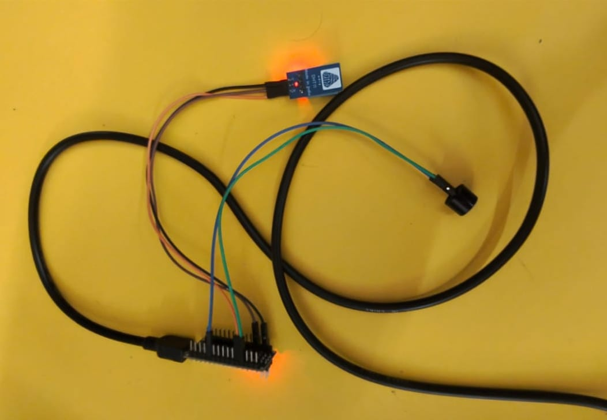

# Vehicle Overheating Detection and Warning System

## Problem Statement

Vehicle overheating can cause smoke emission and may lead to fire or other serious damage if abnormal temperature conditions are not detected early.

## Proposed Solution

This project uses an Arduino Nano and DHT11 temperature sensor to continuously monitor temperature. When the temperature reaches the programmed threshold, an active buzzer provides an immediate warning.

## Objectives

- Detect abnormal temperature conditions.
- Provide an early warning to the driver.
- Develop a simple and low-cost safety prototype.

## Components

- Arduino Nano
- DHT11 Temperature Sensor
- 5V Active Buzzer
- Jumper Wires
- Breadboard
- 5V USB Power Supply

## Circuit Connections

| Component | Connection |
|---|---|
| DHT11 VCC | Arduino Nano 5V |
| DHT11 DATA | Arduino Nano D2 |
| DHT11 GND | Arduino Nano GND |
| Buzzer + | Arduino Nano D8 |
| Buzzer - | Arduino Nano GND |

## Working

1. DHT11 measures the temperature.
2. Arduino Nano reads the sensor value.
3. The temperature is compared with a preset threshold.
4. If the threshold is exceeded, the buzzer turns ON.
5. When the temperature returns below the threshold, the buzzer turns OFF.

## Mathematical Model

T = Temperature measured by DHT11

If:

T >= T_limit

then:

Buzzer = ON

Otherwise:

Buzzer = OFF

## Group Photo

## Prototype Photo

## Technologies Used

- Arduino Nano
- DHT11
- Arduino IDE

## Learning Outcomes

- Temperature sensing
- Arduino programming
- Threshold-based control
- Hardware troubleshooting

## SDG Mapping

### SDG 3 – Good Health and Well-being
Supports early warning for potentially hazardous vehicle overheating conditions.

### SDG 9 – Industry, Innovation and Infrastructure
Demonstrates an electronics-based safety and monitoring solution.

### SDG 11 – Sustainable Cities and Communities
Supports safer and more resilient transportation systems.

## Future Improvements

- Smoke detection
- Mobile notifications
- Data logging
- GPS integration
- Automatic fault reporting

## Conclusion

The project demonstrates a simple and low-cost vehicle overheating early-warning system using Arduino Nano and DHT11. It continuously monitors temperature and alerts the user when the programmed threshold is exceeded.
